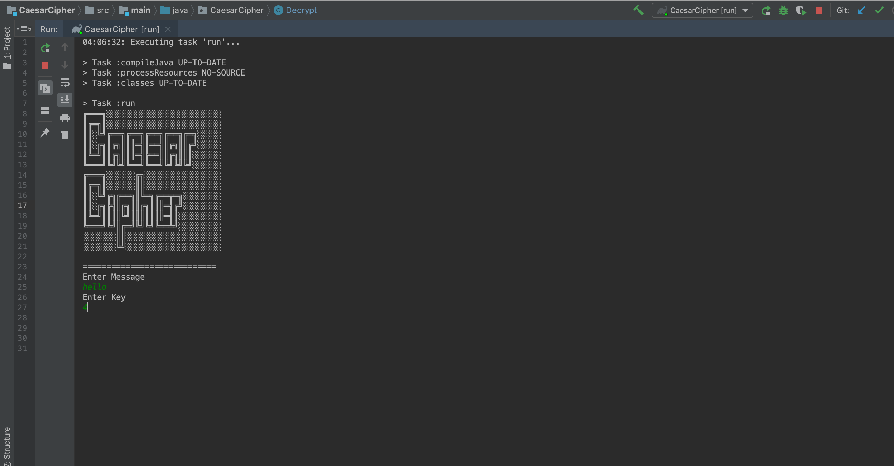
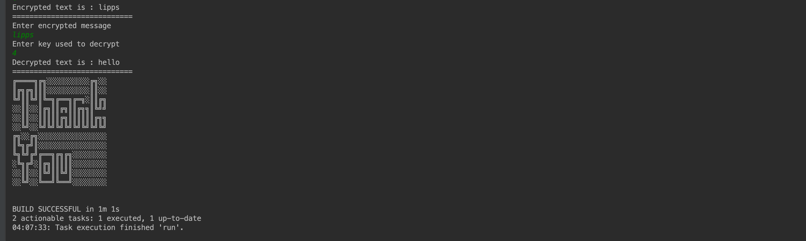

# CaesarCipher
This program uses Java to encrypt and decrypt messages by replacing the characters in the message by using an encryption key specified by the user

Version 1.0.0

# Contributors
Raymond Gitonga

## Description and Usage
This program uses the Caesar Cipher method of encryption to encrypt the messages. The characters in the message are replaced
bynew characters depending on the encryption key entered. The key shifts the characters forward depending on the key number
and replaces the characters with the new characters as specified by the key. The user inputs a message then specifies how 
many positions they would like the characters of their message shifted by, the program then encrypts the message and outputs
the encrypted message. The user can also use the program to decrypt the message by simply inputting the message that was encrypted
the key that was used and pressing enter, the process being the same but this time in reverse.

## BDD
|Behaviour   	|  Input  	|   Output	|   	
|---	|---	|---	|
|Encryption   	|Message: "Hello" Encryption key: 4|Encrypted message: "Lipps"|   	
|Decryption	|Message: "Lipps" Encryption key used: 4|Decrypted message: "Hello"	|   

## Setup Installation Requirement
To access this project, you will need to access it from github then clone it.
Then run 'git clone https://github.com/raymondleta/CaesarCipher' on your terminal

## Technologies Used
1. Java
2. ASCII

### Support or questions
For any questions feel free to contact me through gitongaraymondd@gmail.com

## License 
MIT 2019
Raymond Gitonga
